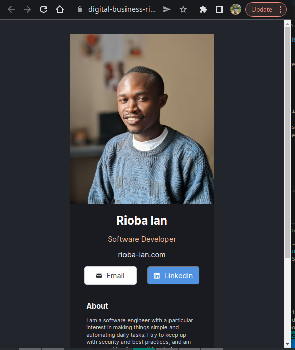
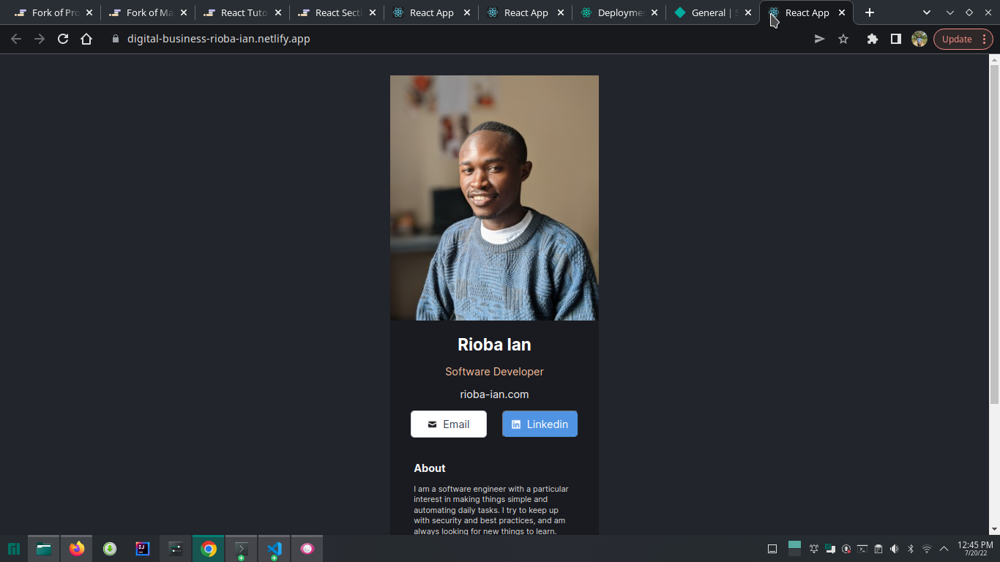

# Digital business card with React

My first react project. It is a single page application with react. I have used three components Footer, Main and Navigation. 

## What I've learnt 

* Structuring an application into components using react.
* Linking react components inside the App.js
* Deploying my react app to netlify from the terminal

## Preview of the app

1. Mobile view

2. Desktop view

Although for this specific project, the mobile view was more important to implement.